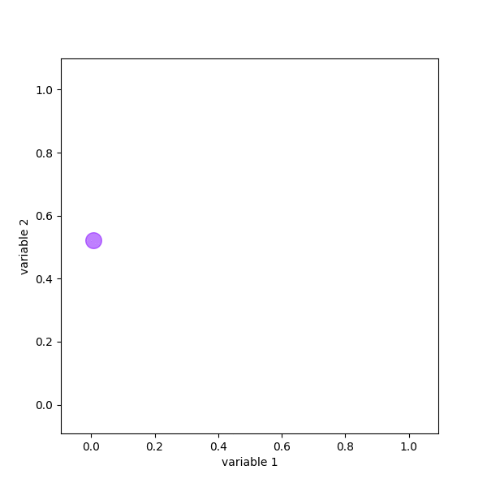

There are a number of ways to generate animated graphs. In this post, I will
use a combination of matplotlib and
[ImageMagick](http://www.imagemagick.org/script/index.php) to produce a
relatively easy and robust way to generate an animated gif of a graph. It is
possible to do this directly with matplotlib, however, I found this to be a
little fiddly.

## General Method

The easiest way to generate a gif without needing to change pre-existing code
too much is to create a large number of individual graphs and then stitch them
together. The graphs are created with matplotlib and saved as png files, though
any plotting library could be used. ImageMagick is then called to stitch all
the individual images together.

## Automating

The automated script is relatively simple. In the following example, some
random points are generated and iteratively added to the plot. ImageMagick is
then called with a command line argument within the script and an gif file
saved.

  ```python
  """Assumes http://www.imagemagick.org/ has been installed."""
  import numpy as np
  import subprocess
  import matplotlib.pyplot as plt
  import matplotlib.cm as cm

  size = 100  # number of data points

  # generate some random data to plot
  x = np.random.random_sample(size)
  y = np.random.random_sample(size)
  index = list(range(size))

  # create a list to store filenames to be stitched
  fname = []

  # loop over data points and generate all plots
  for i in index:
      fig = plt.figure(figsize=(6, 6))
      ax = fig.add_subplot(111)
      ax.axis([min(x)-0.1, max(x)+0.1, min(y)-0.1, max(y)+0.1])
      ax.scatter(x[:i+1], y[:i+1], c=index[:i+1], cmap=cm.rainbow, alpha=0.5,
                 s=200)

      n = 'graph_{0}.png'.format(i)
      fname.append(n)
      fig.savefig(n)

  # make the gif calling ImageMagick
  call = 'convert -delay 15 -loop 0 '
  for i in fname:
      call += i + ' '
  call += 'animated.gif'

  subprocess.call(call, shell=True)
  ```

The graph then comes out as below:



## Conclusions

This is a flexible way to generated an animated graph. The underlying plotting
function doesn't really need changing, and just needs wrapping in a loop to
produce the appropriate number of images. These images are then stitched
together with some appropriate delay.
