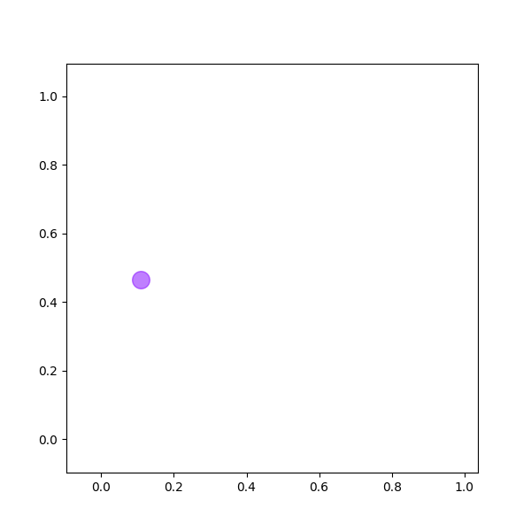

There are a number of ways to generate animated graphs. In this post, I will use a combination of matplotlib and [ImageMagick](http://www.imagemagick.org/script/index.php) to produce a relatively easy and robust way to generate an animated gif of a graph. It is possible to do this directly with matplotlib, however, I found this to be a little fiddly.

## General Method

The easiest way to generate a gif without needing to change pre-existing code too much is to create a large number of individual graphs and then stitch them together. The graphs are created with matplotlib and saved as png files, though any plotting library could be used. ImageMagick is then called to stitch all the individual images together.

## Automating

The automated script is relatively simple.

The graph comes out as follows:

