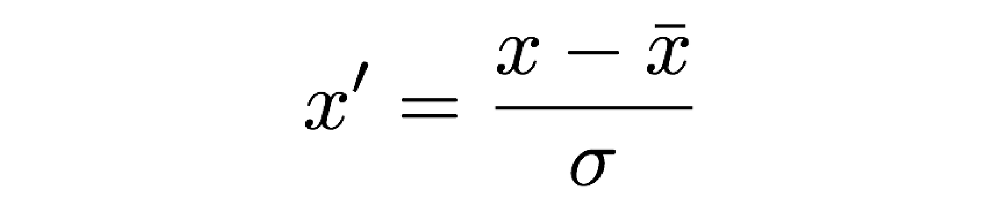

With many application of machine learning, it is not possible to know the scope of the data that may be generated during a production run. This becomes particularly prevalent when the space in which data can occupy is large, or simply unknown. Further, problems with scaling methods can arise from the method of data generation producing data points that can initially be significant outliers. This can be particularly problematic in studies I have undertaken recently when coupling machine learning with search methods.

## Common Scaling Methods

Two very commonly used methods of scaling data are standardization and normalization. The meaning of these can vary slightly between field so I will define them first. For the purposes of this discussion, standardization is defined as follows:

$$
{\color{white}{x}^{\prime} = \frac{x - \bar{x}}{\sigma}}
$$

And normalization as below:
